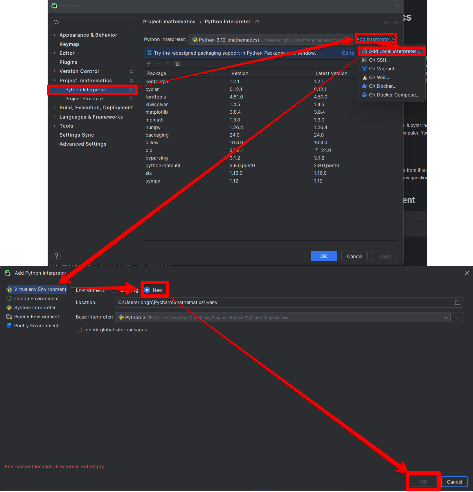

# Jupyter Mathematics
## Introduction
This is a collection of Jupyter notebooks that I have created to help me learn mathematics. I have found that the best way to learn mathematics is to write about it. I have also found that the best way to write about mathematics is to use Jupyter notebooks. This is because Jupyter notebooks allow you to write mathematics in a way that is easy to read and easy to understand. In this collection of notebooks, I will be writing about a wide range of mathematical topics, from basic arithmetic to advanced calculus. I hope that you find these notebooks helpful in your own study of mathematics.

## System Requirements
To run these notebooks, you will need to have Pycharm installed on your computer. You can download Pycharm from the following link: https://www.jetbrains.com/pycharm/download/

## Getting Started
To get started, simply download the notebooks from this repository and open them in Jupyter. You can then read through the notebooks and run the code cells to see the results. If you have any questions or comments, please feel free to reach out to me.

## Setup Virtual Environment


## Libraries Used
The following libraries are used in these notebooks:
- Matplotlib
- SymPy

## Install Libraries
To install the required libraries, run the following command in your terminal:
```
pip install -r requirements.txt
```

### Install MathJax
To install MathJax, run the following command in your terminal:
```
pip install mathjax
jupyter server extension enable --py jupyter_server_mathjax
```